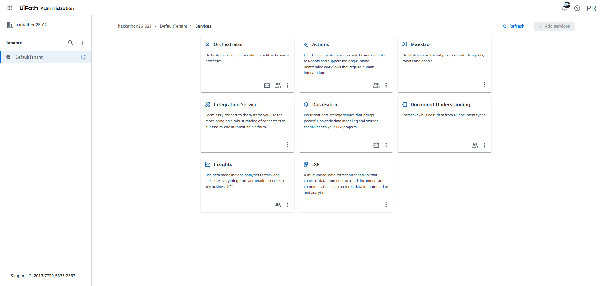
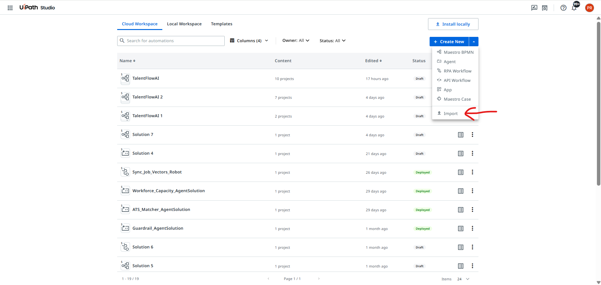
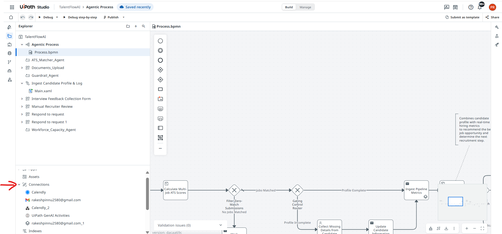

# TalentFlowAI - Installation & Setup Guide

This guide explains how to deploy and configure **TalentFlowAI** in UiPath Automation Cloud.


---

# Prerequisites

Before starting the installation, ensure the following services are available in your UiPath Automation Cloud tenant.

- UiPath Maestro
- UiPath Data Fabric
- UiPath Integration Service
- UiPath Actions



---

# Step 1 - Import the Solutions

Navigate to:

**Automation Cloud → UiPath Studio → Import**

The required solution files are available in the **[Solution](../Solution)** folder of this GitHub repository.

Import the following solutions:

### 1. TalentFlowAI.uis

This is the primary recruitment orchestration solution responsible for the end-to-end recruitment workflow.

### 2. Sync_Job_Vectors_Robot.uis

This solution synchronizes the latest Job Postings data with the AI Vector Index, enabling semantic job matching.

> **Note:** Ensure both solutions are imported successfully before proceeding to the next steps.



---

# Step 2 - Configure Integration Service Connections

Open the **TalentFlowAI** solution.

Navigate to the **Connections** section.

Configure all required connections.




---

## 2.1 Gmail Connection

The Gmail connection acts as the **central recruitment mailbox** for TalentFlowAI.

### Purpose

This mailbox is used to:

- Receive new candidate applications.
- Trigger the TalentFlowAI Maestro process whenever a new application email is received.
- Send interview invitations to shortlisted candidates.
- Send rejection emails to non-selected candidates.
- Send follow-up communications throughout the recruitment process.

> **Important:** This mailbox serves as the primary communication channel for the solution. The TalentFlowAI Maestro workflow is triggered automatically whenever a new email is received in this mailbox. All outgoing candidate communications are also sent using the same Gmail account.

### Configuration Steps

1. Open the **Connections** tab in the imported TalentFlowAI solution.
2. Select **Gmail**.
3. Click **Add Connection**.
4. Authenticate using the Gmail account that will be used as the recruitment mailbox.
5. Save the connection.

---

## 2.2 Data Service Connection

The UiPath Data Service acts as the **centralized database** for TalentFlowAI, storing and managing all recruitment-related information throughout the candidate lifecycle.

### Purpose

The Data Service is used to:

- Store candidate profiles and other information.
- Maintain all candidate applications.
- Store job postings available for recruitment.
- Track the current stage of every candidate application.
- Store interview details and scheduling information.

### How TalentFlowAI Uses Data Service

Whenever a new application email is received:

1. The Maestro workflow checks whether the candidate already exists in the Data Service.
2. If the candidate does not exist, a new candidate record is created.
3. A new application record is created for the candidate.
4. If the candidate already has an active application, the workflow processes it according to the configured business rules.
5. Throughout the recruitment process, the application status is continuously updated in the Data Service, allowing recruiters to easily track the candidate's current stage.

The Data Service serves as the **single source of truth** for candidate and recruitment information, ensuring all AI agents, workflows, and HR users operate on the latest data.

### Configuration Steps

1. Open the **Connections** tab in the imported TalentFlowAI solution.
2. Select **UiPath Data Service**
3. Click **Add Connection**.
4. Select your Automation Cloud tenant.
5. Save the connection.

---

## 2.3 GenAI Activities Connection

The **UiPath GenAI Activities** connection enables TalentFlowAI to perform AI-powered job matching by querying the Vector Index built from the organization's job postings.

### Purpose

The GenAI Activities are used to:

- Retrieve the most relevant job postings for a candidate using semantic search.
- Compare candidate resumes against available job openings.
- Provide contextual information to AI agents for accurate evaluation.
- Support AI-driven ATS scoring and candidate assessment.

### How TalentFlowAI Uses GenAI Activities

TalentFlowAI maintains an up-to-date **Vector Index** containing all active job postings. This index is automatically updated by the **Sync_Job_Vectors_Robot** solution whenever job posting data changes.

When a new candidate application is received:

1. The candidate's resume is analyzed.
2. The GenAI Activities query the Vector Index to retrieve the most relevant job postings based on the candidate's skills and experience.
3. The retrieved job postings are provided as context to the AI agents.
4. The AI agents calculate ATS scores, evaluate the candidate against multiple job openings, and recommend the best matching positions.


### Configuration Steps

1. Open the **Connections** tab in the imported TalentFlowAI solution.
2. Select **UiPath GenAI Activities**.
3. Click **Add Connection**.
4. Authenticate using your Automation Cloud account.
5. Save the connection.

---

## 2.4 Calendly Connection

The Calendly connection enables TalentFlowAI to automatically schedule interviews by integrating with the organization's Calendly account.

### Purpose

The Calendly connection is used to:

- Generate interview scheduling links.
- Allow candidates to book interview slots based on real-time interviewer availability.
- Eliminate manual interview scheduling.
- Provide a seamless self-service scheduling experience for candidates.

### How TalentFlowAI Uses Calendly

After a candidate successfully clears the AI evaluation stage, TalentFlowAI automatically generates a Calendly scheduling link and sends it to the candidate via Gmail.

The candidate can then:

1. Open the scheduling link.
2. View the interviewer's real-time availability.
3. Select a convenient interview slot.
4. Confirm the booking.

This removes the need for HR to manually coordinate interview timings and significantly reduces scheduling effort.

### Configuration Steps

1. Open the **Connections** tab in the imported TalentFlowAI solution.
2. Select **Calendly**.
3. Click **Add Connection**.
4. Authenticate using your Calendly account.
5. Save the connection.

---

## 2.5 Calendly Webhook Connection

The Calendly Webhook enables TalentFlowAI to automatically resume the recruitment workflow whenever a candidate books an interview slot.

### Purpose

The Calendly Webhook is used to:

- Detect when a candidate successfully books an interview.
- Automatically resume the UiPath Maestro workflow.
- Update interview details in the Data Service.
- Continue the recruitment process without manual intervention.

### How TalentFlowAI Uses the Calendly Webhook

After the interview scheduling email is sent, the TalentFlowAI workflow waits for the candidate to book an interview slot.

When the candidate confirms a booking in Calendly:

1. Calendly sends the booking event to the Webhook URL generated by the TalentFlowAI solution.
2. The webhook notifies UiPath Maestro that the interview has been scheduled.
3. The Maestro workflow resumes automatically.
4. Interview details are updated in the Data Service.
5. The workflow continues with the remaining recruitment stages, such as HR document collection and verification.

This event-driven approach eliminates the need for polling and allows the recruitment workflow to continue automatically.

### Configuration Steps

After generating the **Webhook URL** from the TalentFlowAI solution, configure Calendly to notify this endpoint whenever a candidate books an interview.

##### 2.5.1 Generate a Personal Access Token

1. Log in to your Calendly account.
2. Navigate to:

   **Settings**
   ↓
   **Integrations & Apps**
   ↓
   **API and Webhooks**
   ↓
   **Create Personal Access Token**

3. Enter a token name (e.g., **TalentFlowAI**).
4. Select the required **Webhook** scope.
5. Verify your email address (if prompted).
6. Copy the generated **Personal Access Token**.

---

##### 2.5.2 Retrieve the Current User URI

The Current User URI is required when creating the webhook subscription.

1. Open the following API documentation:

   https://developer.calendly.com/api-docs/005832c83aeae-get-current-user

2. Execute the API using the following header:

```
Authorization: Bearer <Personal Access Token>
```

3. Locate the **resource.uri** field in the response.

Example:

```
https://api.calendly.com/users/XXXXXXXXXXXX
```

4. Copy this value for the next step.

---

##### 2.5.3 Create the Webhook Subscription

1. Open the following API documentation:

   https://developer.calendly.com/api-docs/c1ddc06ce1f1b-create-webhook-subscription

2. Configure the request using the following values:

| Field | Value |
|--------|-------|
| Authorization | Bearer `<Personal Access Token>` |
| Callback URL | TalentFlowAI Webhook URL |
| User | Current User URI |
| Events | `invitee.created` |

3. Execute the request.
4. Verify that the webhook subscription is created successfully.

---

##### 2.5.4 Validate the Webhook

1. Use the interview scheduling link generated by TalentFlowAI.
2. Book a test interview slot.
3. Verify that Calendly triggers the webhook.
4. Confirm that the UiPath Maestro workflow resumes automatically.


> **Important:** The Webhook URL generated by TalentFlowAI must be configured in Calendly. Once the webhook subscription is active, every interview booking automatically triggers the UiPath Maestro workflow, allowing the recruitment process to continue without manual intervention.


# Step 3 - Import the Data Service Schema

Navigate to:

**Automation Cloud**  
↓  
**Data Fabric**  
↓  
**Import Schema**

The required Data Service schema is available in the **[DataService](../DataService)** folder of this GitHub repository.

Import the following file:

**Schema.json**

After the import is completed, verify that:

- All **Entities (Data Tables)** are created successfully.
- All **Choice Sets** are imported successfully.
- The entity relationships and field definitions are created correctly.

> **Note:** This schema contains all the Data Service components required by both **TalentFlowAI** and **TalentFlowAI-Indexer**. Importing this schema automatically creates all entities and choice sets used throughout the solution.

---

# Step 4 - Create the Storage Bucket

Navigate to

Automation Cloud

↓

Storage Buckets

↓

Create Storage Bucket

Create a Storage Bucket that will store the Job Posting CSV generated by the Indexer solution.

---

# Step 6 - Create the Vector Index

Navigate to

Automation Cloud

↓

Indexes

↓

Create Index

Configure the index using the Storage Bucket created in the previous step.

This Vector Index is used by the ATS Scoring Agent to perform semantic job matching.

---

# Step 7 - Run TalentFlowAI-Indexer

The **Sync_Job_Vectors_Robot** solution is available in the **[Solution](../Solution)** folder of this GitHub repository.

Execute the following solution:

**Sync_Job_Vectors_Robot.uis**

This solution synchronizes the latest Job Posting data with the AI Vector Index and should be executed:

- After the initial installation.
- Whenever new job postings are added.
- Whenever existing job postings are modified.
- Whenever job postings are removed.

The workflow performs the following operations:

```text
Job Postings (Data Service)
        ↓
Download Job Posting Records
        ↓
Generate CSV File
        ↓
Upload CSV to Storage Bucket
        ↓
Update AI Vector Index
```

After successful execution, the latest job postings become available for semantic search and AI-powered job matching.

---

# Step 8 - Run TalentFlowAI

Execute the **TalentFlowAI** solution.

The process performs the following workflow.

Candidate Applies

↓

Resume Analysis

↓

Relevant Context Agent

↓

ATS Scoring Agent

↓

Workflow Capacity Agent

↓

AI Decision

↓

Human Review (If Required)

↓

Interview Scheduling

↓

Calendly

↓

Webhook Trigger

↓

HR Document Collection


---

# Step 9 - Validate the Installation

Verify the following.

| Validation | Status |
|------------|--------|
| TalentFlowAI Imported | ✅ |
| TalentFlowAI-Indexer Imported | ✅ |
| Gmail Connected | ✅ |
| Data Service Connected | ✅ |
| GenAI Connected | ✅ |
| Data Service Schema Imported | ✅ |
| Calendly Configured | ✅ |
| Webhook Created | ✅ |
| Storage Bucket Created | ✅ |
| Vector Index Created | ✅ |
| TalentFlowAI-Indexer Executed Successfully | ✅ |
| TalentFlowAI Running Successfully | ✅ |

---

# Troubleshooting

## Gmail Connection Failed

- Re-authenticate the Gmail connection.
- Verify the connection status.

---

## Calendly Webhook Not Triggering

- Verify the Personal Access Token.
- Verify the Webhook Subscription.
- Ensure the callback URL is correct.

---

## Data Service Import Failed

- Verify Data Service permissions.
- Re-import the schema.

---

## Vector Index Not Updating

- Verify the Storage Bucket exists.
- Verify the CSV file is uploaded successfully.
- Re-run the TalentFlowAI-Indexer workflow.

---

# Congratulations 🎉

TalentFlowAI is now successfully configured and ready to automate the end-to-end recruitment lifecycle using UiPath Maestro, AI Agents, Data Service, Calendly, and Gmail.
